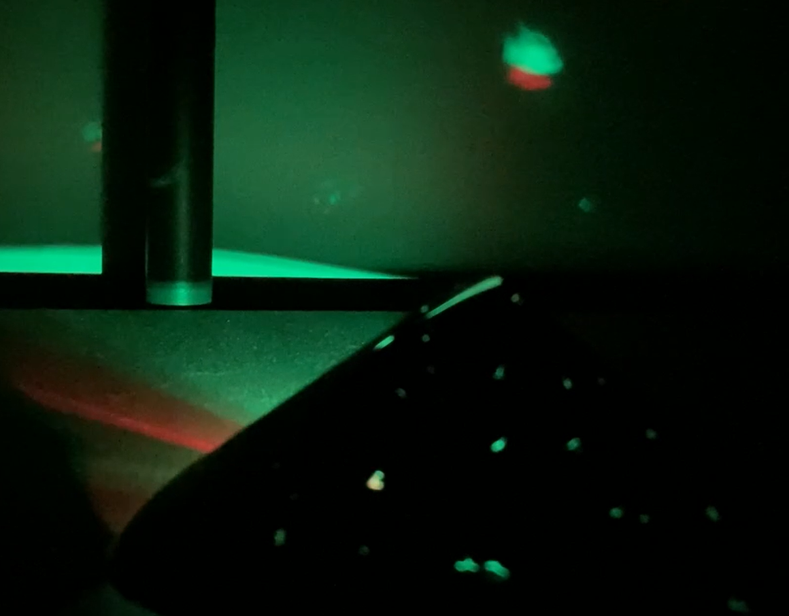

## Introduction

Make a fidget toy or sensory gadget. Your gadget will need to meet the **project brief**. 

A sensory gadget is something that makes you want to keep interacting with it. A fidget toy is a type of sensory gadget that helps the user relieve stress or improve their concentration. An adaptive gadget can be used by people with physical disabilities for communication. A sensory gadget might stimulate all the senses or just focus on one.

You will:
+ Use your digital making skills to design and make a gadget for a user
+ Use physical inputs such as buttons and potentiometers to control physical outputs such as LEDs and a buzzer
+ Let others try our your gadget and improve it based on their feedback

--- no-print ---

--- task ---

### Try it

Watch the video below. How is the tool being used for communication? What inputs and outputs have been used?

**An assistive gadget**
A user can select an option to let their carer know of their current need. Once they have made a selection, they press another button that alerts their carer.

<video width="640" height="360" controls>
<source src="images/communication-tool.mp4" type="video/mp4">
Your browser does not support WebM video, try FireFox or Chrome
</video>

--- collapse ---
---
title: See inside
---
--- code ---
---
language: python
filename: assistive_gadget.py
line_numbers: true
line_number_start: 1
line_highlights: 
---
from picozero import LED, Speaker, Button
from time import sleep

eat = LED(13)
drink = LED(8)
play = LED(5)

speaker = Speaker(1)

choose = Button(18)
confirm = Button(22)

option = 0 # Store the current option

def choice(): # Call the next function and update the option
    global option
    if option == 0:
        eat.on()
        drink.off()
        play.off()
    elif option == 1:
        eat.off()
        drink.on()
        play.off()    
    elif option == 2:
        eat.off()
        drink.off()
        play.on()   
    elif option == 3:
        eat.off()
        drink.off()
        play.off()

    if option == 3:
        option = 0
    else:
        option = option + 1

def sound_buzzer():
    speaker.on()
    sleep(1)
    speaker.off()

choose.when_pressed = choice 
confirm.when_pressed = sound_buzzer
--- /code ---

--- /collapse ---

--- /task ---

--- /no-print ---

--- print-only ---

**An assistive gadget**
A user can select an option to let their carer know of their current need. Once they have made a selection, they press another button that alerts their carer.

--- /print-only ---

### PROJECT BRIEF: Project title

Brief explanation of the aims of the project. 

Your sensory gadget should:
+ Have multiple different kinds of input
+ Have multiple different outputs
+ Be appealing to the user and robust enough to be used

Your sensory gadget could:
+ Take ergonomics like user comfort into consideration
+ Reset on user input or after a set amount of time 
+ Connect to a specific theme

Ergonomics is a science that seeks to overcome problems and improve how humans can interact with their environment. Improving the ergonomics of a gadget will make it easier to use and more comfortable to interact with. 

--- no-print ---

### Get inspiration

--- task ---

Think about the sensory gadget that you would like to make as you investigate these example projects:

**The night sky**
Tiny holes have been poked through a piece of black card to make a night sky effect on a ceiling in a dark room. An RGB LED pulses to create a twinkling effect. A button is used to switch the light on and off.

<video width="640" height="360" controls>
<source src="images/the-night-sky.mp4" type="video/mp4">
Your browser does not support WebM video, try FireFox or Chrome
</video>

--- collapse ---
---
title: See inside
---
--- code ---
---
language: python
filename: night_sky.py
line_numbers: true
line_number_start: 
line_highlights: 
---
from picozero import RGBLED, Button

rgb = RGBLED(1, 2, 3)
button = Button(18)
option = 0

def change_option():
    global option
    option += 1
        
    if option == 1:
        rgb.cycle()
    else:
        rgb.off()
        option = 0

button.when_pressed = change_option
--- /code ---

--- /collapse ---

**The buzzy bee**
The bee's wings have kitchen foil on the back of them and when pressed down they connect to another piece of foil on the card — this makes a buzzer play a note. Each wing plays a different sound. A potentiometer controls a blue LED on the bee's tail.

<video width="640" height="360" controls>
<source src="images/buzy-bee.mp4" type="video/mp4">
Your browser does not support WebM video, try FireFox or Chrome
</video>

--- collapse ---
---
title: See inside
---
--- code ---
---
language: python
filename: 
line_numbers: true
line_number_start: 
line_highlights: 
---
from picozero import LED, Speaker, Button, Pot

led = LED(13)
speaker1 = Speaker(5)
speaker2 = Speaker(10)
button1 = Button(18)
button2 = Button(28)
dial = Pot(0)

def tune1():
    speaker1.play(500)  
    print('1 pressed')

def tune2():
    speaker2.play(600) 
    print('2 pressed')

while True:
    led.brightness = dial.percent
    button1.when_pressed = tune1
    button2.when_pressed = tune2

--- /code ---

--- /collapse ---

**Picosaber**
Pressing the button lights the blade of the saber and starts the buzzers making a humming sound. Turning the potentiometer changes the colour of the blade and pitch of the hum. Turning the potentiometer all the way down plays a 'power-down sound' then switches off the lights and buzzers.

<video width="640" height="360" controls>
<source src="images/picosaber.mp4" type="video/mp4">
Your browser does not support WebM video, try FireFox or Chrome
</video>

--- collapse ---
---
title: See inside
---
--- code ---
---
language: python
filename: saber.py
line_numbers: true
line_number_start: 
line_highlights: 
---
from time import sleep
from picozero import Button, RGBLED, Pot, Speaker
from random import randint

led = RGBLED(13,14,15) # Set up RGBLED
led2 = RGBLED(10,11,12) # Set up other RGBLED — the more, the brighter!

hum = Speaker(5) # Set up passive buzzer for hum/start/stop sounds

power = Button(17) # Set up button to turn on saber

dial = Pot(0) # Set up potentiometer to change blade colour and turn off

# Turn off lights and make 'power-down' sound
def off():
    for i in range(400): # White noise loop 1 second
        tone = randint(4000,6000) # Pick a random number between 4000 and 6000
        hum.play(tone, 0.001) # Play tone for 1/1000th second
    for i in range(200): # White noise loop 1 second
        tone = randint(2000,4000) # Pick a random number between 2000 and 4000
        hum.play(tone, 0.001) # Play tone for 1/1000th second
    for i in range(200): # White noise loop 1 second
        tone = randint(1000,3000) # Pick a random number between 1000 and 3000
        hum.play(tone, 0.001) # Play tone for 1/1000th second
    for i in range(200): # White noise loop 1 second
        tone = randint(50,1000) # Pick a random number between 50 and 1000
        hum.play(tone, 0.001) # Play tone for 1/1000th second
    led.color = (0,0,0)
    led2.color = (0,0,0)
    hum.off()

# Make lightsaber start sound then turn on lights
def on():
    for i in range(200): # White noise loop 0.2 second
        tone = randint(50,1000) # Pick a random number between 50 and 1000
        hum.play(tone, 0.001) # Play tone for 1/1000th second
    for i in range(200): # White noise loop 0.2 second
        tone = randint(1000,3000) # Pick a random number between 1000 and 3000
        hum.play(tone, 0.001) # Play tone for 1/1000th second
    for i in range(200): # White noise loop 0.2 second
        tone = randint(2000,4000) # Pick a random number between 2000 and 4000
        hum.play(tone, 0.001) # Play tone for 1/1000th second
    for i in range(400): # White noise loop 0.4 second
        tone = randint(3000,5000) # Pick a random number between 3000 and 5000
        hum.play(tone, 0.001) # Play tone for 1/1000th second
    while True: # Forever loop checking the dial reading to set colour and change hum sound
        if dial.value >= 0.8: # Highest setting on dial - 5
            led.color = (255,255,255) # White
            led2.color = (255,255,255)
            hum.play(90)
        elif dial.value >= 0.6: # High setting on dial - 4
            led.color = (255,0,255) # Purple blade
            led2.color = (255,0,255)
            hum.play(80)
        elif dial.value >= 0.4: # Middle setting on dial - 3
            led.color = (0,0,255) # Blue blade
            led2.color = (0,0,255)
            hum.play(70)
        elif dial.value >= 0.2: # Low setting on dial - 2
            led.color = (0,255,0) # Green blade
            led2.color = (0,255,0)
            hum.play(60)
        elif dial.value >= 0.01: # Lowest setting on dial (above 0.01) - 1
            led.color = (255,0,0) # Red blade
            led2.color = (255,0,0)
            hum.play(50)
        else: # If dial turned all the way down - 0
            off() # Run off function
            break # Leave the loop
    

power.when_pressed = on
--- /code ---

--- /collapse ---

**Digital candle**
The RGB LED is on a loop that appears like a flickering flame. Blowing on the candle causes a foil contact to touch another contact on the candle and stop the loop. After a while, the loop restarts.

--- collapse ---
---
title: See inside
---

--- code ---
---
language: python
filename: candle.py
line_numbers: true
line_number_start: 
line_highlights: 
---
from picozero import RGBLED, Switch
from time import sleep
from random import randint

# State which pins the components are attached to on the Pico
led = RGBLED(13, 14, 15)
trigger = Switch(18)

def light(): # Flickering flame loop
      red = randint(125,255) # Mostly red
      yellow = (red - 125) # Never more than red
      delay = randint(0,100)
      led.color = (red, yellow, 0)
      sleep(delay/1000)

def dark(): # No flame
   led.off()
   sleep(2) # Dark time before reset

# Loop to check if switch is closed
while True: 
    if trigger.is_closed:
        dark()
    else:
        light()

--- /code ---

--- /collapse ---

--- /task ---

--- /no-print ---

--- print-only ---

**An assistive gadget**
A user can select an option to let their carer know of their current need. Once they have made a selection, they press another button that alerts their carer.

**The night sky**
Tiny holes have been poked through a piece of black card to make a starry night effect on a ceiling in a dark room. An RGB LED pulses to create a twinkling effect.

**The buzzy bee**
The bee's wings have kitchen foil on the back of them and when pressed down they connect to another piece of foil on the card — this makes a buzzer play a note. Each wing plays a different sound. A potentiometer controls a blue LED on the bee's tail.

**Picosaber**
Pressing the button lights the blade of the saber and starts the buzzers making a humming sound. Turning the potentiometer changes the colour of the blade and pitch of the hum. Turning the potentiometer all the way down plays a 'power-down sound' then switches off the lights and buzzers.

**Digital candle**
The RGB LED is on a loop that appears like a flickering flame. Blowing on the candle causes a foil contact to another contact on the candle and stop the loop. After a while, the loop restarts.

--- /print-only ---

