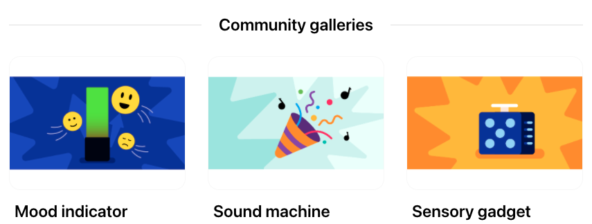

## Share

If you are in a club, why not share your project with friends? You could also show your family how your project works.

--- task ---

Inspire the Raspberry Pi Foundation community with your project!

To submit a video of your gadget to our [Sensory gadget - Community](https://wke.lt/w/s/qX5TaK){:target="_blank"} gallery, please complete [this form](https://form.raspberrypi.org/f/community-project-submissions){:target="_blank"}. Remember to protect your identity by making sure that people do not appear in your video.

--- /task ---

--- no-print ---

**The Night Sky**

The original **Night Sky** project used a single RGBLED and a piece of card with holes poked through it to simulate a starry sky using projected light, which could be turned on and off by a button. 

This upgraded version of the project adds another RGBLED to increase the brightness, and adds a diffuser for the LEDs to spread the light around more widely. 

The card with holes has been replaced by a lasercut dodecahedron, with the logos of popular superheroes used as cutouts to project the light into the room. 

<video width="640" height="360" controls>
<source src="images/PicoUpgrade.mp4" type="video/mp4">
Your browser does not support WebM video, try FireFox or Chrome
</video>

--- /no-print ---

--- print-only ---

**The Night Sky**

The original **Night Sky** project used a single RGBLED and a piece of card with holes poked through it to simulate a starry sky using projected light, which could be turned on and off by a button.  

This upgraded version of the project adds another RGBLED to increase the brightness, and adds a diffuser for the LEDs to spread the light around more widely. 

The card with holes has been replaced by a lasercut dodecahedron, with the logos of popular superheroes used as cutouts to project the light into the room. 

{:width="300px"}

--- /print-only ---

--- task ---

Take a look at our 
[Sensory gadget - Community](https://wke.lt/w/s/qX5TaK){:target="_blank"} gallery to see projects created by our community members.

--- /task ---
