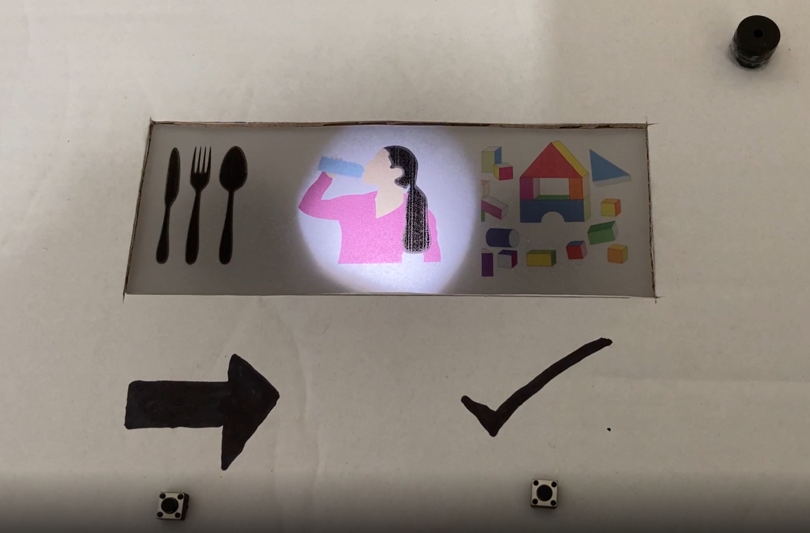
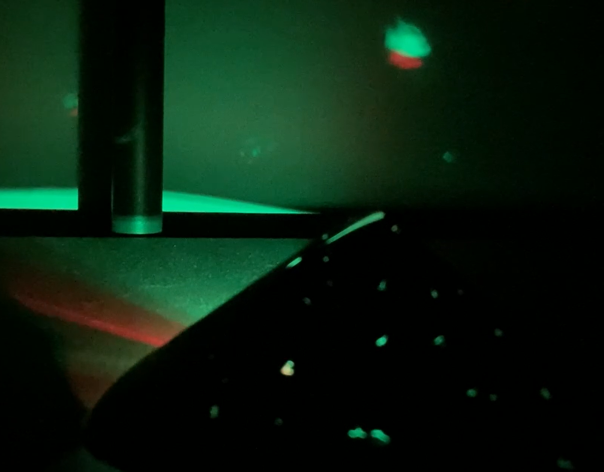

## You will make

Fabriquer un jouet ou un gadget sensoriel. Your gadget will need to meet the **project brief**.

Un gadget sensoriel est quelque chose qui te donne envie de continuer à interagir avec lui. Un jouet fidget est un type de gadget sensoriel qui aide l'utilisateur à soulager le stress ou à améliorer sa concentration. Un gadget adaptatif peut être utilisé par les personnes souffrant d'un handicap physique pour communiquer. Un gadget sensoriel peut stimuler tous les sens ou se concentrer sur un seul.

Tu vas devoir :
+ Utiliser tes compétences en création numérique pour concevoir et fabriquer un gadget pour un utilisateur
+ Utiliser des entrées physiques telles que des boutons et des potentiomètres pour contrôler des sorties physiques telles que des LEDs et un buzzer
+ Laisser les autres essayer ton gadget et l'améliorer en fonction de leurs commentaires

--- no-print ---

Pour mener à bien ce projet, tu auras besoin de :

**Matériel :**

Tu peux acheter tout le matériel requis pour ce projet et les autres projets du parcours à partir de la [boutique en ligne Pimoroni.](https://shop.pimoroni.com/products/pico-intro-kit?variant=39893512945747){:target='_blank'}

Si tu as déjà un Raspberry Pi Pico, tu peux acheter les composants électroniques dont tu as besoin pour ce projet et les autres projets dans le chemin de [La boutique en ligne Kitronik.](https://kitronik.co.uk/products/5343-raspberry-pi-foundation-pico-pathway-pack)

+ Un Raspberry Pi Pico avec des broches soudées dessus
+ Un câble de données USB A vers micro USB
+ Une variété de composants électroniques et de câbles de liaison

**Logiciel:**
+ Thonny : ce projet peut être réalisé à l'aide de l'éditeur Thonny Python, qui peut être installé sur un ordinateur Linux, Windows ou Mac.

[[[thonny-install]]]

[[[change-theme-thonny]]]

+ picozero - tu devras configurer picozero sur ton Raspberry Pi Pico

[[[set-up-picozero]]]

--- task ---

### Découvrir ▶️

Regarde la vidéo ci-dessous. Comment l'outil est-il utilisé pour la communication ? Quelles entrées et sorties ont été utilisées ?

**Un gadget d'assistance** Un utilisateur peut sélectionner une option pour informer son soignant de son besoin actuel. Une fois qu'ils ont fait une sélection, ils appuient sur un autre bouton qui alerte leur soignant.

<video width="640" height="360" controls>
<source src="images/communication-tool.mp4" type="video/mp4">
Ton navigateur ne prend pas en charge la vidéo WebM, essaye FireFox ou Chrome
</video>

--- collapse ---
---
title : Voir à l'intérieur
---
--- code ---
---
language: python filename: assistive_gadget.py line_numbers: true line_number_start: 1
line_highlights:
---
from picozero import LED, Speaker, Button from time import sleep

eat = LED(13) drink = LED(8) play = LED(5)

speaker = Speaker(1)

choose = Button(18) confirm = Button(22)

option = 0 # Store the current option

def choice(): # Call the next function and update the option global option if option == 0: eat.on() drink.off() play.off() elif option == 1: eat.off() drink.on() play.off()    
elif option == 2: eat.off() drink.off() play.on()   
elif option == 3: eat.off() drink.off() play.off()

    if option == 3:
        option = 0
    else:
        option = option + 1

def sound_buzzer(): speaker.on() sleep(1) speaker.off()

choose.when_pressed = choice confirm.when_pressed = sound_buzzer --- /code ---

--- /collapse ---

--- /task ---

--- /no-print ---

--- print-only ---

**Un gadget d'assistance** Un utilisateur peut sélectionner une option pour informer son soignant de son besoin actuel. Une fois qu'ils ont fait une sélection, ils appuient sur un autre bouton qui alerte leur soignant.

--- /print-only ---

### résumé du projet : Gadget sensoriel

Fabrique un gadget sensoriel que les gens voudront utiliser.

Ton gadget sensoriel devrait :
+ Avoir plusieurs types d'entrées différents
+ Avoir plusieurs sorties différentes
+ Être attrayant pour l'utilisateur et suffisamment robuste pour être utilisé

Ton gadget sensoriel pourrait :
+ Prendre en considération l'ergonomie comme le confort de l'utilisateur
+ Réinitialiser sur saisie de l'utilisateur ou après un laps de temps défini 
+ Se connecter à un thème spécifique

L'ergonomie est une science qui cherche à surmonter les problèmes et à améliorer la façon dont les humains peuvent interagir avec leur environnement. L'amélioration de l'ergonomie d'un gadget le rendra plus facile à utiliser et plus agréable à manipuler. 

--- no-print ---

### Trouver des idées 💭

--- task ---

Pense au gadget sensoriel que tu aimerais créer en étudiant ces exemples de projets :

**Le ciel nocturne** De minuscules trous ont été percés dans un morceau de carton noir pour créer un effet de ciel nocturne sur le plafond d'une pièce sombre. Une LED RVB émet des impulsions pour créer un effet scintillant. Un bouton sert à allumer et éteindre la lumière.

<video width="640" height="360" controls>
<source src="images/the-night-sky.mp4" type="video/mp4">
Ton navigateur ne prend pas en charge la vidéo WebM, essaye FireFox ou Chrome
</video>

--- collapse ---
---
title : Voir à l'intérieur
---
--- code ---
---
language: python filename: night_sky.py line_numbers: true line_number_start:
line_highlights:
---
from picozero import RGBLED, Button

rgb = RGBLED(1, 2, 3) button = Button(18) option = 0

def change_option(): global option option += 1

    if option == 1:
        rgb.cycle()
    else:
        rgb.off()
        option = 0

button.when_pressed = change_option --- /code ---

--- /collapse ---

**L'abeille bourdonnante** Les ailes de l'abeille ont du papier d'aluminium à l'arrière et lorsqu'elles sont enfoncées, elles se connectent à un autre morceau de papier d'aluminium sur la carte — cela fait jouer une note à un buzzer. Chaque aile joue un son différent. Un potentiomètre contrôle une LED bleue sur la queue de l'abeille.

<video width="640" height="360" controls>
<source src="images/buzy-bee.mp4" type="video/mp4">
Ton navigateur ne prend pas en charge la vidéo WebM, essaye FireFox ou Chrome
</video>

--- collapse ---
---
title : Voir à l'intérieur
---
--- code ---
---
language: python filename: line_numbers: true line_number_start:
line_highlights:
---
from picozero import LED, Speaker, Button, Pot

led = LED(13) speaker1 = Speaker(5) speaker2 = Speaker(10) button1 = Button(18) button2 = Button(28) dial = Pot(0)

def tune1(): speaker1.play(500)  
print('1 pressed')

def tune2(): speaker2.play(600) print('2 pressed')

while True: led.brightness = dial.percent button1.when_pressed = tune1 button2.when_pressed = tune2

--- /code ---

--- /collapse ---

**Picosaber** En appuyant sur le bouton, la lame du sabre s'allume et les buzzers émettent un bourdonnement. Tourner le potentiomètre change la couleur de la lame et la hauteur du bourdonnement. Tourner le potentiomètre à fond produit un « son de mise hors tension », puis éteint les lumières et les buzzers.

<video width="640" height="360" controls>
<source src="images/picosaber.mp4" type="video/mp4">
Ton navigateur ne prend pas en charge la vidéo WebM, essaye FireFox ou Chrome
</video>

--- collapse ---
---
title : Voir à l'intérieur
---
--- code ---
---
language: python filename: saber.py line_numbers: true line_number_start:
line_highlights:
---
from time import sleep from picozero import Button, RGBLED, Pot, Speaker from random import randint

led = RGBLED(13,14,15) # Set up RGBLED led2 = RGBLED(10,11,12) # Set up other RGBLED — the more, the brighter!

hum = Speaker(5) # Set up passive buzzer for hum/start/stop sounds

power = Button(17) # Set up button to turn on saber

dial = Pot(0) # Set up potentiometer to change blade colour and turn off

# Éteindre les lumières et faire un son de « mise hors tension »
def off(): for i in range(400): # White noise loop 1 second tone = randint(4000,6000) # Pick a random number between 4000 and 6000 hum.play(tone, 0.001) # Play tone for 1/1000th second for i in range(200): # White noise loop 1 second tone = randint(2000,4000) # Pick a random number between 2000 and 4000 hum.play(tone, 0.001) # Play tone for 1/1000th second for i in range(200): # White noise loop 1 second tone = randint(1000,3000) # Pick a random number between 1000 and 3000 hum.play(tone, 0.001) # Play tone for 1/1000th second for i in range(200): # White noise loop 1 second tone = randint(50,1000) # Pick a random number between 50 and 1000 hum.play(tone, 0.001) # Play tone for 1/1000th second led.color = (0,0,0) led2.color = (0,0,0) hum.off()

# Faire sonner le sabre laser puis allumer les lumières
def on(): for i in range(200): # White noise loop 0.2 second tone = randint(50,1000) # Pick a random number between 50 and 1000 hum.play(tone, 0.001) # Play tone for 1/1000th second for i in range(200): # White noise loop 0.2 second tone = randint(1000,3000) # Pick a random number between 1000 and 3000 hum.play(tone, 0.001) # Play tone for 1/1000th second for i in range(200): # White noise loop 0.2 second tone = randint(2000,4000) # Pick a random number between 2000 and 4000 hum.play(tone, 0.001) # Play tone for 1/1000th second for i in range(400): # White noise loop 0.4 second tone = randint(3000,5000) # Pick a random number between 3000 and 5000 hum.play(tone, 0.001) # Play tone for 1/1000th second while True: # Forever loop checking the dial reading to set colour and change hum sound if dial.value >= 0.8: # Highest setting on dial - 5 led.color = (255,255,255) # White led2.color = (255,255,255) hum.play(90) elif dial.value >= 0.6: # High setting on dial - 4 led.color = (255,0,255) # Purple blade led2.color = (255,0,255) hum.play(80) elif dial.value >= 0.4: # Middle setting on dial - 3 led.color = (0,0,255) # Blue blade led2.color = (0,0,255) hum.play(70) elif dial.value >= 0.2: # Low setting on dial - 2 led.color = (0,255,0) # Green blade led2.color = (0,255,0) hum.play(60) elif dial.value >= 0.01: # Lowest setting on dial (above 0.01) - 1 led.color = (255,0,0) # Red blade led2.color = (255,0,0) hum.play(50) else: # If dial turned all the way down - 0 off() # Run off function break # Leave the loop

power.when_pressed = on --- /code ---

--- /collapse ---

**Bougie numérique** La LED RVB est sur une boucle qui ressemble à une flamme vacillante. En soufflant sur la bougie, un contact en feuille d'aluminium touche un autre contact de la bougie et arrête la boucle. Au bout d'un moment, la boucle redémarre.

--- collapse ---
---
title : Voir à l'intérieur
---

--- code ---
---
language: python filename: candle.py line_numbers: true line_number_start:
line_highlights:
---
from picozero import RGBLED, Switch from time import sleep from random import randint

# Indiquer à quelles broches les composants sont attachés sur le Pico
led = RGBLED(13, 14, 15) trigger = Switch(18)

def light(): # Flickering flame loop red = randint(125,255) # Mostly red yellow = (red - 125) # Never more than red delay = randint(0,100) led.color = (red, yellow, 0) sleep(delay/1000)

def dark(): # No flame led.off() sleep(2) # Dark time before reset

# Boucle pour vérifier si l'interrupteur est fermé
while True: if trigger.is_closed: dark() else: light()

--- /code ---

--- /collapse ---

--- /task ---

--- /no-print ---

--- print-only ---

**Un gadget d'assistance** Un utilisateur peut sélectionner une option pour informer son soignant de son besoin actuel. Une fois qu'ils ont fait une sélection, ils appuient sur un autre bouton qui alerte leur soignant. 

**Le ciel nocturne** De minuscules trous ont été percés dans un morceau de carton noir pour créer un effet de nuit étoilée sur le plafond d'une pièce sombre. Une LED RVB émet des impulsions pour créer un effet scintillant. 

**L'abeille bourdonnante** Les ailes de l'abeille ont du papier d'aluminium à l'arrière et lorsqu'elles sont enfoncées, elles se connectent à un autre morceau de papier d'aluminium sur la carte — cela fait qu'un buzzer joue une note. Chaque aile joue un son différent. Un potentiomètre contrôle une LED bleue sur la queue de l'abeille. 

**Picosaber** En appuyant sur le bouton, la lame du sabre s'allume et les avertisseurs émettent un bourdonnement. Tourner le potentiomètre change la couleur de la lame et la hauteur du bourdonnement. Tourner le potentiomètre à fond produit un « son de mise hors tension », puis éteint les lumières et les buzzers. 

**Bougie numérique** La LED RVB est sur une boucle qui ressemble à une flamme vacillante. Souffler sur la bougie provoque un contact entre une feuille d'aluminium et un autre contact sur la bougie et stoppe la boucle. Au bout d'un moment, la boucle redémarre.

--- /print-only ---

