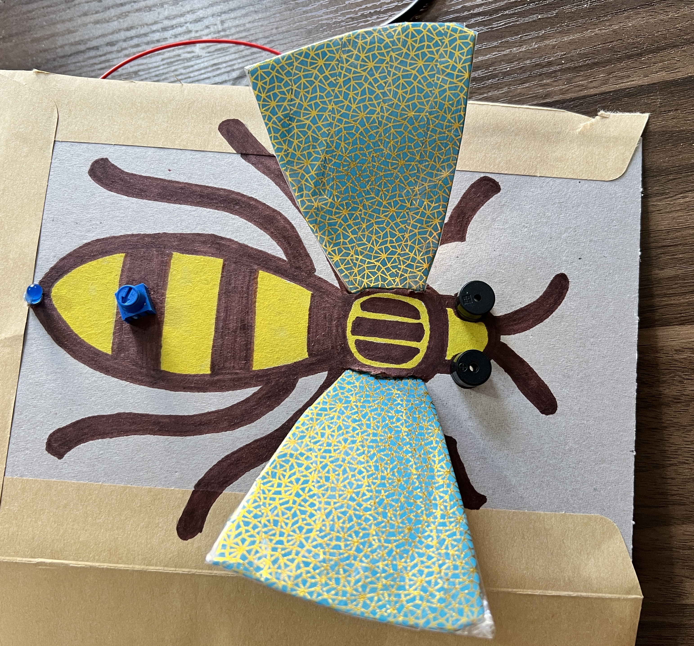

## Ton idée

Utilise cette étape pour planifier ton gadget sensoriel. Tu peux planifier simplement en pensant, en bricolant, en dessinant ou en écrivant, ou comme bon te semble !  

{:width="300px"}

### Pourquoi fabriques-tu ton gadget sensoriel ?

--- task ---

Réfléchis à l'objectif de ton gadget sensoriel.

Ça pourrait être :
+ Pour qu'un petit frère ou une petite sœur apprenne à connaître les images et les sons
+ Un moyen de soulager la tension en appuyant sur des boutons et en entendant des sons
+ Un outil de communication pour aider les gens à exprimer leurs besoins

--- /task ---

### À qui s'adresse-t-il ?

--- task ---

Pense à la personne pour laquelle tu vas fabriquer ton gadget sensoriel (ton **public**).

Cela peut être pour un ami, pour un membre de la famille, pour une classe scolaire, pour des personnes qui partagent un passe-temps, pour des fans d'une émission télévisée ou d'un musicien, ou tout simplement pour toi-même.

--- /task ---

### Quelles fonctionnalités ton gadget aura-t-il ?

--- task ---

Pense au nombre de composants dont ton gadget aura besoin.

[[[pico-limitations]]]

--- /task ---

--- task ---

Pense aux types d'entrées et de sorties que tu auras.

Ton gadget pourrait :
+ Avoir des boutons poussoirs pour les entrées
+ Utiliser des interrupteurs fabriqués
+ Utiliser une entrée à cadran à l'aide d'un potentiomètre
+ Jouer un son spécifique
+ Jouer un morceau, ou plusieurs morceaux
+ Utiliser des LEDs monochromes
+ Utiliser une LED RVB

--- /task ---

--- task ---

Pense à quoi ressemblera ton gadget sensoriel.

Ça pourrait:

+ Être basé sur un gadget sensoriel qui existe déjà comme un fidget cube ou un popper
+ Avoir un thème basé sur ta bande dessinée, émission de télévision ou chanson préférée
+ Être une enceinte artisanale fabriquée à partir d'une vieille boîte en carton, d'un matériau en tissu ou d'un récipient en plastique

--- /task ---

### Commencer

--- task ---

Rassemble les composants dont tu auras besoin pour fabriquer ton gadget sensoriel. Tu auras besoin d'entrées, de sorties, de fils de liaison et de ton Raspberry Pi Pico.

--- /task ---

--- task ---

**Test :** Connecte ton Raspberry Pi Pico à ton ordinateur et vérifie qu'il fonctionne en faisant clignoter la LED embarquée.

Voici un exemple de code pour faire clignoter la LED intégrée :

--- code ---
---
language: python filename: line_numbers: false line_number_start: 1
line_highlights:
---
from picozero import pico_led from time import sleep

pico_led.on() sleep(1) pico_led.off() --- /code ---

--- /task ---

--- task ---

Si tu n'as pas encore préparé tes entrées et sorties et que tu as besoin de te rappeler comment connecter les LED aux résistances et aux fils de liaison, consulte notre guide [Introduction au Pico](https://projects.raspberrypi.org/en/projects/introduction-to-the-pico){:target="_blank"}.

--- /task ---

