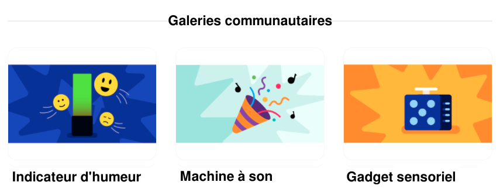

## Partager

Si tu es dans un club, pourquoi ne pas partager ton projet avec des amis ? Tu peux également montrer à ta famille comment fonctionne ton projet.

--- task ---

Inspire la communauté Raspberry Pi Foundation avec ton projet !

Pour soumettre une vidéo de ton gadget dans notre galerie [Gadget sensoriel - Communauté](https://wke.lt/w/s/qX5TaK){:target="_blank"}, remplis [ce formulaire](https://form.raspberrypi.org/f/community-project-submissions){:target="_blank"}. N'oublie pas de protéger ton identité en veillant à ce que personne n'apparaisse dans ta vidéo.

--- /task ---

--- no-print ---

**Le ciel nocturne**

Le projet original **Ciel nocturne** utilisait une seule LED RGB et un morceau de carton percé de trous pour simuler un ciel étoilé à l'aide d'une lumière projetée, qui pouvait être allumée et éteinte par un bouton.

Cette version améliorée du projet ajoute un autre LED RGB pour augmenter la luminosité et ajoute un diffuseur pour que les LED diffusent plus largement la lumière.

Le carton troué a été remplacé par un dodécaèdre découpé au laser, avec les logos de super-héros populaires utilisés comme découpes pour projeter la lumière dans la pièce.

<video width="640" height="360" controls>
<source src="images/PicoUpgrade.mp4" type="video/mp4">
Ton navigateur ne prend pas en charge la vidéo WebM, essaye FireFox ou Chrome
</video>

--- /no-print ---

--- print-only ---

**Le ciel nocturne**

Le projet original **Ciel nocturne** utilisait une seule LED RGB et un morceau de carton percé de trous pour simuler un ciel étoilé à l'aide d'une lumière projetée, qui pouvait être allumée et éteinte par un bouton.

Cette version améliorée du projet ajoute un autre LED RGB pour augmenter la luminosité et ajoute un diffuseur pour que les LED diffusent plus largement la lumière.

Le carton troué a été remplacé par un dodécaèdre découpé au laser, avec les logos de super-héros populaires utilisés comme découpes pour projeter la lumière dans la pièce.

{:width="300px"}

--- /print-only ---

--- task ---

Jette un œil à notre galerie [Gadget sensoriel - Communauté](https://wke.lt/w/s/qX5TaK){:target="_blank"} pour voir les projets créés par les membres de notre communauté.

--- /task ---
