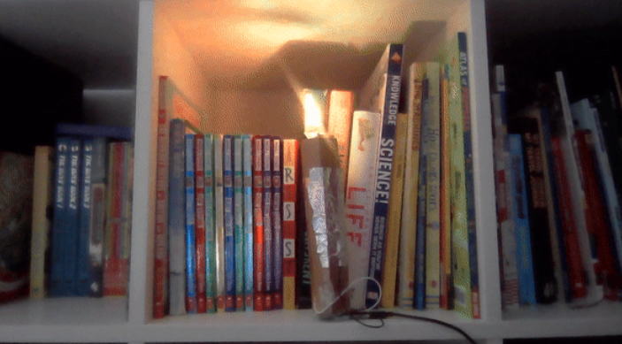

## Wat ga je maken

Maak een speeltje of een sensorische gadget. Je gadget moet voldoen aan de **projectsamenvatting**.

Een sensorische gadget is iets waar je mee wilt blijven communiceren. Een fidget speeltje is een type zintuiglijk gadget dat de gebruiker helpt stress te verlichten of zijn concentratie te verbeteren. Een adaptieve gadget kan door mensen met een lichamelijke beperking worden gebruikt voor communicatie. Een zintuiglijke gadget kan alle zintuigen prikkelen of slechts op één ervan focussen.

Je gaat:
+ Je digitale maakvaardigheden gebruiken om een gadget voor een gebruiker te ontwerpen en te maken
+ Fysieke ingangen gebruiken zoals knoppen en potentiometers om fysieke uitgangen zoals LED's en een zoemer te regelen
+ Anderen je gadget laten uitproberen en het verbeteren op basis van hun feedback

--- no-print ---

Om dit project te voltooien heb je het volgende nodig:

**Hardware:**

Je kunt alle benodigde hardware voor dit project en de andere projecten in dit pad kopen in de [Pimoroni webwinkel.](https://shop.pimoroni.com/products/pico-intro-kit?variant=39893512945747){:target='_blank'}

Als je al een Raspberry Pi Pico hebt, kun je de elektronische componenten die je nodig hebt voor dit project en de andere projecten in het pad kopen bij [de Kitronik webwinkel.](https://kitronik.co.uk/products/5343-raspberry-pi-foundation-pico-pathway-pack){: target='_blank

+ Een Raspberry Pi Pico met gesoldeerde pinnen
+ Een data USB A naar micro USB-kabel
+ Een verscheidenheid aan elektronische componenten en verbindingsdraden

**Software:**
+ Thonny – dit project kan worden voltooid met de Thonny Python editor, die kan worden geïnstalleerd op een Linux-, Windows- of Mac-computer.

[[[thonny-install]]]

[[[change-theme-thonny]]]

+ picozero - je moet picozero instellen op je Raspberry Pi Pico

[[[set-up-picozero]]]

--- task ---

### Ontdek ▶️

Bekijk de onderstaande video. Hoe wordt de gadget gebruikt voor communicatie? Welke ingangen en uitgangen zijn gebruikt?

**Een hulpgadget** Een gebruiker kan een optie selecteren om zijn verzorger op de hoogte te stellen van zijn huidige behoefte. Zodra ze een selectie hebben gemaakt, drukken ze op een andere knop die hun verzorger waarschuwt.

<video width="640" height="360" controls>
<source src="images/communication-tool.mp4" type="video/mp4">
Je browser ondersteunt geen WebM-video, probeer Firefox of Chrome
</video>

--- collapse ---
---
Title: Zie binnenkant
---
--- code ---
---
language: python filename: assistive_gadget.py line_numbers: true line_number_start: 1
line_highlights:
---
from picozero import LED, Speaker, Button from time import sleep

eat = LED(13) drink = LED(8) play = LED(5)

speaker = Speaker(1)

choose = Button(18) confirm = Button(22)

option = 0 # Store the current option

def choice(): # Call the next function and update the option global option if option == 0: eat.on() drink.off() play.off() elif option == 1: eat.off() drink.on() play.off()    
elif option == 2: eat.off() drink.off() play.on()   
elif option == 3: eat.off() drink.off() play.off()

    if option == 3:
        option = 0
    else:
        option = option + 1

def sound_buzzer(): speaker.on() sleep(1) speaker.off()

choose.when_pressed = choice confirm.when_pressed = sound_buzzer --- /code ---

--- /collapse ---

--- /task ---

--- /no-print ---

--- print-only ---

**Een hulpgadget** Een gebruiker kan een optie selecteren om zijn verzorger op de hoogte te stellen van zijn huidige behoefte. Zodra ze een selectie hebben gemaakt, drukken ze op een andere knop die hun verzorger waarschuwt.

--- /print-only ---

### PROJECT SAMENVATTING: Sensorische gadget

Maak een sensorische gadget die mensen willen gebruiken.

Je sensorische gadget moet:
+ meerdere verschillende soorten invoer hebben 
+ meerdere verschillende uitgangen hebben 
+ aantrekkelijk zijn voor de gebruiker en robuust genoeg om gebruikt te worden

Je sensorische gadget kan:
+ Rekening houden met ergonomie zoals gebruikerscomfort
+ Zich resetten op gebruikersinvoer of na een ingestelde hoeveelheid tijd
+ Verbonden zijn met een specifiek thema

Ergonomie is een wetenschap die probeert problemen te overwinnen en de manier te verbeteren waarop mensen met hun omgeving kunnen communiceren. Het verbeteren van de ergonomie van een gadget zal het makkelijker maken om te gebruiken en comfortabeler om mee te communiceren. 

--- no-print ---

### Ideeën opdoen 💭

--- task ---

Denk aan het sensorische gadget dat je wilt maken als je deze voorbeeldprojecten onderzoekt:

**De nachtelijke hemel** Kleine gaten zijn door een stuk zwarte kaart geprikt om een sterrenhemel effect te maken op een plafond in een donkere kamer. Een RGB-LED pulseert om een fonkelend effect te creëren. Een knop wordt gebruikt om het licht in en uit te schakelen.

<video width="640" height="360" controls>
<source src="images/the-night-sky.mp4" type="video/mp4">
Je browser ondersteunt geen WebM-video, probeer Firefox of Chrome
</video>

--- collapse ---
---
Title: Zie binnenkant
---
--- code ---
---
language: python filename: night_sky.py line_numbers: true line_number_start:
line_highlights:
---
from picozero import RGBLED, Button

rgb = RGBLED(1, 2, 3) button = Button(18) option = 0

def change_option(): global option option += 1

    if option == 1:
        rgb.cycle()
    else:
        rgb.off()
        option = 0

button.when_pressed = change_option --- /code ---

--- /collapse ---

**De bezige bij** De vleugels van de bij hebben een keukenfolie op de achterkant en als ze omlaag worden gedrukt, verbinden ze zich met een ander stukje folie op de kaart; hierdoor speelt een zoemer een toon. Elke vleugel speelt een ander geluid. Een potentiometer bestuurt een blauwe LED op de staart van de bij.

<video width="640" height="360" controls>
<source src="images/buzy-bee.mp4" type="video/mp4">
Je browser ondersteunt geen WebM-video, probeer Firefox of Chrome
</video>

--- collapse ---
---
Title: Zie binnenkant
---
--- code ---
---
language: python filename: line_numbers: true line_number_start:
line_highlights:
---
from picozero import LED, Speaker, Button, Pot

led = LED(13) speaker1 = Speaker(5) speaker2 = Speaker(10) button1 = Button(18) button2 = Button(28) dial = Pot(0)

def tune1(): speaker1.play(500)  
print('1 pressed')

def tune2(): speaker2.play(600) print('2 pressed')

while True: led.brightness = dial.percent button1.when_pressed = tune1 button2.when_pressed = tune2

--- /code ---

--- /collapse ---

**Picosabel** Als op de knop wordt gedrukt, licht het blad van de sabel op en beginnen de zoemers een geluid te maken. Door aan het instelwiel te draaien verandert de kleur van het blad en de toonhoogte van de zoem. Als het instelwiel helemaal naar beneden wordt gedraaid, klinkt er een 'power-down'-geluid en worden de lampjes en zoemers uitgeschakeld.

<video width="640" height="360" controls>
<source src="images/picosaber.mp4" type="video/mp4">
Je browser ondersteunt geen WebM-video, probeer Firefox of Chrome
</video>

--- collapse ---
---
Title: Zie binnenkant
---
--- code ---
---
language: python filename: saber.py line_numbers: true line_number_start:
line_highlights:
---
from time import sleep from picozero import Button, RGBLED, Pot, Speaker from random import randint

led = RGBLED(13,14,15) # Set up RGBLED led2 = RGBLED(10,11,12) # Set up other RGBLED — the more, the brighter!

hum = Speaker(5) # Set up passive buzzer for hum/start/stop sounds

power = Button(17) # Set up button to turn on saber

dial = Pot(0) # Set up potentiometer to change blade colour and turn off

# Schakel de lampjes uit en maak een 'power-down'-geluid
def off(): for i in range(400): # White noise loop 1 second tone = randint(4000,6000) # Pick a random number between 4000 and 6000 hum.play(tone, 0.001) # Play tone for 1/1000th second for i in range(200): # White noise loop 1 second tone = randint(2000,4000) # Pick a random number between 2000 and 4000 hum.play(tone, 0.001) # Play tone for 1/1000th second for i in range(200): # White noise loop 1 second tone = randint(1000,3000) # Pick a random number between 1000 and 3000 hum.play(tone, 0.001) # Play tone for 1/1000th second for i in range(200): # White noise loop 1 second tone = randint(50,1000) # Pick a random number between 50 and 1000 hum.play(tone, 0.001) # Play tone for 1/1000th second led.color = (0,0,0) led2.color = (0,0,0) hum.off()

# Laat de lichtsabel beginnen met geluid en schakel vervolgens de lichten in
def on(): for i in range(200): # White noise loop 0.2 second tone = randint(50,1000) # Pick a random number between 50 and 1000 hum.play(tone, 0.001) # Play tone for 1/1000th second for i in range(200): # White noise loop 0.2 second tone = randint(1000,3000) # Pick a random number between 1000 and 3000 hum.play(tone, 0.001) # Play tone for 1/1000th second for i in range(200): # White noise loop 0.2 second tone = randint(2000,4000) # Pick a random number between 2000 and 4000 hum.play(tone, 0.001) # Play tone for 1/1000th second for i in range(400): # White noise loop 0.4 second tone = randint(3000,5000) # Pick a random number between 3000 and 5000 hum.play(tone, 0.001) # Play tone for 1/1000th second while True: # Forever loop checking the dial reading to set colour and change hum sound if dial.value >= 0.8: # Highest setting on dial - 5 led.color = (255,255,255) # White led2.color = (255,255,255) hum.play(90) elif dial.value >= 0.6: # High setting on dial - 4 led.color = (255,0,255) # Purple blade led2.color = (255,0,255) hum.play(80) elif dial.value >= 0.4: # Middle setting on dial - 3 led.color = (0,0,255) # Blue blade led2.color = (0,0,255) hum.play(70) elif dial.value >= 0.2: # Low setting on dial - 2 led.color = (0,255,0) # Green blade led2.color = (0,255,0) hum.play(60) elif dial.value >= 0.01: # Lowest setting on dial (above 0.01) - 1 led.color = (255,0,0) # Red blade led2.color = (255,0,0) hum.play(50) else: # If dial turned all the way down - 0 off() # Run off function break # Leave the loop

power.when_pressed = on --- /code ---

--- /collapse ---

**digitale kaars** de RGB LED zit in een lus die lijkt op een flakkerende vlam. Door op de kaars te blazen, komt een folie in contact met een ander contact op de kaars en stopt de lus. Na een tijdje start de lus opnieuw.

--- collapse ---
---
Title: Zie binnenkant
---

--- code ---
---
language: python filename: candle.py line_numbers: true line_number_start:
line_highlights:
---
from picozero import RGBLED, Switch from time import sleep from random import randint

# Geef aan op welke pinnen de onderdelen op de Pico zijn bevestigd
led = RGBLED(13, 14, 15) trigger = Switch(18)

def light(): # Flickering flame loop red = randint(125,255) # Mostly red yellow = (red - 125) # Never more than red delay = randint(0,100) led.color = (red, yellow, 0) sleep(delay/1000)

def dark(): # No flame led.off() sleep(2) # Dark time before reset

# Lus om te controleren of de schakelaar gesloten is
while True: if trigger.is_closed: dark() else: light()

--- /code ---

--- /collapse ---

--- /task ---

--- /no-print ---

--- print-only ---

**een hulpgadget** Een gebruiker kan een optie selecteren om zijn verzorger op de hoogte te stellen van zijn huidige behoefte. Zodra ze een selectie hebben gemaakt, drukken ze op een andere knop die hun verzorger waarschuwt. 

**De nachtelijke hemel** Kleine gaten zijn door een stuk zwarte kaart geprikt om een sterrenhemel effect te maken op een plafond in een donkere kamer. Een RGB-LED pulseert om een fonkelend effect te creëren. 

**De bezige bij** De vleugels van de bij hebben een keukenfolie op de achterkant en als ze omlaag worden gedrukt, verbinden ze zich met een ander stukje folie op de kaart; hierdoor speelt een zoemer een toon. Elke vleugel speelt een ander geluid. Een potentiometer bestuurt een blauwe LED op de staart van de bij. 

**Picosabel** Als op de knop wordt gedrukt, licht het blad van de sabel op en beginnen de zoemers een geluid te maken. Door aan het instelwiel te draaien verandert de kleur van het blad en de toonhoogte van de zoem. Als het instelwiel helemaal naar beneden wordt gedraaid, klinkt er een 'power-down'-geluid en worden de lampjes en zoemers uitgeschakeld. 

**digitale kaars** de RGB LED zit in een lus die lijkt op een flakkerende vlam. Door op de kaars te blazen, komt een folie in contact met een ander contact op de kaars en stopt de lus. Na een tijdje start de lus opnieuw.

--- /print-only ---

