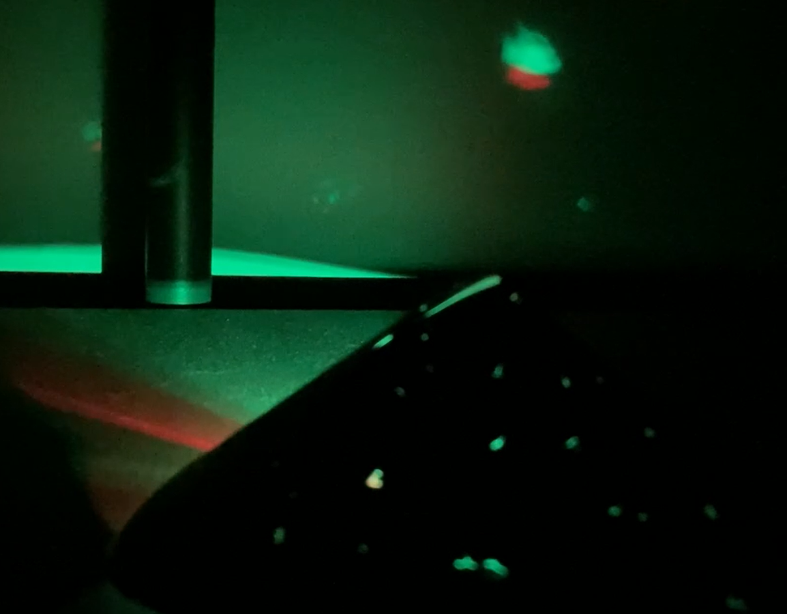

## Wat ga je maken

Maak een speeltje of een sensorische gadget. Je gadget moet voldoen aan de **projectsamenvatting**.

Een sensorische gadget is iets waar je mee wilt blijven communiceren. Een fidget speeltje is een type zintuiglijk gadget dat de gebruiker helpt stress te verlichten of zijn concentratie te verbeteren. Een adaptieve gadget kan door mensen met een lichamelijke beperking worden gebruikt voor communicatie. Een zintuiglijke gadget kan alle zintuigen prikkelen of slechts op één ervan focussen.

Je gaat:
+ Je digitale maakvaardigheden gebruiken om een gadget voor een gebruiker te ontwerpen en te maken
+ Fysieke ingangen gebruiken zoals knoppen en potentiometers om fysieke uitgangen zoals LED's en een zoemer te besturen
+ Anderen je gadget laten uitproberen en het verbeteren op basis van hun feedback

--- no-print ---

Om dit project te voltooien heb je het volgende nodig:

**Hardware:**

Je kunt alle benodigde hardware voor dit project en de andere projecten in dit pad kopen in de [Pimoroni webwinkel](https://shop.pimoroni.com/products/pico-intro-kit?variant=39893512945747){:target='_blank'} en de [Kitronik webwinkel.](https://kitronik.co.uk/products/5343-raspberry-pi-foundation-pico-pathway-pack){:target='_blank'}

+ Een Raspberry Pi Pico met gesoldeerde pinnen
+ Een data USB A naar micro USB-kabel
+ Een verscheidenheid aan elektronische componenten en verbindingsdraden

**Software:**
+ Thonny – dit project kan worden voltooid met de Thonny Python editor, die kan worden geïnstalleerd op een Linux-, Windows- of Mac-computer.

[[[thonny-install]]]

[[[change-theme-thonny]]]

+ picozero - je moet picozero instellen op je Raspberry Pi Pico

[[[set-up-picozero]]]

--- task ---

### Ontdek ▶️

Bekijk de onderstaande video. Hoe wordt de gadget gebruikt voor communicatie? Welke ingangen en uitgangen zijn gebruikt?

**Een hulpgadget** Een gebruiker kan een optie selecteren om zijn verzorger op de hoogte te stellen van zijn huidige behoefte. Zodra ze een selectie hebben gemaakt, drukken ze op een andere knop die hun verzorger waarschuwt.

<video width="640" height="360" controls>
<source src="images/communication-tool.mp4" type="video/mp4">
Je browser ondersteunt geen WebM-video, probeer Firefox of Chrome
</video>

--- collapse ---
---
title: Bekijk van binnen
---
--- code ---
---
language: python
filename: assistive_gadget.py
line_numbers: true
line_number_start: 1
line_highlights: 
---
from picozero import LED, Speaker, Button
from time import sleep

eet = LED(13)
drink = LED(8)
speel = LED(5)

luidspreker = Speaker(1)

kies = Button(18)
bevestig = Button(22)

optie = 0 # Sla de huidige optie op

def keuze(): # Roep de volgende functie aan en werk de optie bij
    global optie
    if optie == 0:
        eet.on()
        drink.off()
        speel.off()
    elif optie == 1:
        eet.off()
        drink.on()
        speel.off()    
    elif optie == 2:
        eet.off()
        drink.off()
        speel.on()   
    elif optie == 3:
        eet.off()
        drink.off()
        speel.off()

    if optie == 3:
        optie = 0
    else:
        optie = optie + 1

def geluid_zoemer():
    luidspreker.on()
    sleep(1)
    luidspreker.off()

kies.when_pressed = keuze
bevestig.when_pressed = geluid_zoemer
--- /code ---

--- /collapse ---

--- /task ---

--- /no-print ---

--- print-only ---

**Een hulpgadget** Een gebruiker kan een optie selecteren om zijn verzorger op de hoogte te stellen van zijn huidige behoefte. Zodra ze een selectie hebben gemaakt, drukken ze op een andere knop die hun verzorger waarschuwt.

--- /print-only ---

### PROJECT SAMENVATTING: Sensorische gadget

Maak een sensorische gadget die mensen willen gebruiken.

Je sensorische gadget moet:
+ meerdere verschillende soorten invoer hebben 
+ meerdere verschillende uitgangen hebben 
+ aantrekkelijk zijn voor de gebruiker en robuust genoeg om gebruikt te worden

Je sensorische gadget kan:
+ Rekening houden met ergonomie zoals gebruikerscomfort
+ Zich resetten op gebruikersinvoer of na een ingestelde hoeveelheid tijd
+ Verbonden zijn met een specifiek thema

Ergonomie is een wetenschap die probeert problemen te overwinnen en de manier te verbeteren waarop mensen met hun omgeving kunnen communiceren. Het verbeteren van de ergonomie van een gadget zal het makkelijker maken om te gebruiken en comfortabeler om mee te communiceren. 

--- no-print ---

### Ideeën opdoen 💭

--- task ---

Denk aan het sensorische gadget dat je wilt maken als je deze voorbeeldprojecten onderzoekt:

**De nachtelijke hemel** Kleine gaten zijn door een stuk zwarte kaart geprikt om een sterrenhemel effect te maken op een plafond in een donkere kamer. Een RGB-LED pulseert om een fonkelend effect te creëren. Een knop wordt gebruikt om het licht in en uit te schakelen.

<video width="640" height="360" controls>
<source src="images/the-night-sky.mp4" type="video/mp4">
Je browser ondersteunt geen WebM-video, probeer Firefox of Chrome
</video>

--- collapse ---
---
title: Bekijk van binnen
---
--- code ---
---
language: python
filename: night_sky.py
line_numbers: true
line_number_start: 
line_highlights: 
---
from picozero import RGBLED, Button

rgb = RGBLED(1, 2, 3)
knop = Button(18)
optie = 0

def verander_optie():
    global optie
    optie += 1
        
    if optie == 1:
        rgb.cycle()
    else:
        rgb.off()
        optie = 0

knop.when_pressed = verander_optie
--- /code ---

--- /collapse ---

**De bezige bij** De vleugels van de bij hebben keukenfolie op de achterkant en als ze omlaag worden gedrukt, verbinden ze zich met een ander stukje folie op de kaart; hierdoor speelt een zoemer een toon. Elke vleugel speelt een ander geluid. Een potentiometer bestuurt een blauwe LED op de staart van de bij.

<video width="640" height="360" controls>
<source src="images/buzy-bee.mp4" type="video/mp4">
Je browser ondersteunt geen WebM-video, probeer Firefox of Chrome
</video>

--- collapse ---
---
title: Bekijk van binnen
---
--- code ---
---
language: python
filename: 
line_numbers: true
line_number_start: 
line_highlights: 
---
from picozero import LED, Speaker, Button, Pot

led = LED(13)
luidspreker1 = Speaker(5)
luidspreker2 = Speaker(10)
knop1 = Button(18)
knop2 = Button(28)
instelwiel = Pot(0)

def melodie1():
    luidspreker1.play(500)  
    print('1 ingedrukt')

def melodie2():
    luidspreker2.play(600)
    print('2 ingedrukt')

while True:
    led.brightness = instelwiel.percent
    knop1.when_pressed = melodie1
    knop2.when_pressed = melodie2

--- /code ---

--- /collapse ---

**Picosabel** Als op de knop wordt gedrukt, licht het blad van de sabel op en beginnen de zoemers een geluid te maken. Door aan het instelwiel te draaien verandert de kleur van het blad en de toonhoogte van de zoem. Als het instelwiel helemaal naar beneden wordt gedraaid, klinkt er een 'power-down'-geluid en worden de lampjes en zoemers uitgeschakeld.

<video width="640" height="360" controls>
<source src="images/picosaber.mp4" type="video/mp4">
Je browser ondersteunt geen WebM-video, probeer Firefox of Chrome
</video>

--- collapse ---
---
title: Bekijk van binnen
---
--- code ---
---
language: python
filename: saber.py
line_numbers: true
line_number_start: 
line_highlights: 
---
from time import sleep
from picozero import Button, RGBLED, Pot, Speaker
from random import randint

led = RGBLED(13,14,15) # Stel RGB-LED in
led2 = RGBLED(10,11,12) # Stel andere RGB-LED's in: Hoe meer, hoe helderder!

zoem = Speaker(5) # Stel de passieve zoemer in voor zoem-/start-/stopgeluiden

kracht = Button(17) # Stel de knop in om de sabel in te schakelen

instelwiel = Pot(0) # Stel de potentiometer in om de kleur van het blad te veranderen en uit te schakelen

# Schakel de lampjes uit en maak een 'power-down'-geluid
def uit():
    for i in range(400): # Witte ruis lus 1 seconde
        toon = randint(4000,6000) # Neem een willekeurig getal tussen 4000 en 6000
        zoem.play(toon, 0.001) # Speel een toon gedurende 1/1000e seconde
    for i in range(200): # Witte ruis lus 1 seconde
        toon = randint(2000,4000) # PNeem een willekeurig getal tussen 2000 en 4000
        zoem.play(toon, 0.001) # Speel een toon gedurende 1/1000e seconde
    for i in range(200): # Witte ruis lus 1 seconde
        toon = randint(1000,3000) # Neem een willekeurig getal tussen 1000 en 3000
        zoem.play(toon, 0.001) # Speel een toon gedurende 1/1000e seconde
    for i in range(200): # Witte ruis lus 1 seconde
        toon = randint(50,1000) # Neem een willekeurig getal tussen 50 en 1000
        zoem.play(toon, 0.001) # Speel een toon gedurende 1/1000e seconde
    led.color = (0,0,0)
    led2.color = (0,0,0)
    zoem.off()

# Laat de lichtsabel beginnen met geluid en schakel vervolgens de lichten in
def aan():
    for i in range(200): # Witte ruis lus 0.2 seconde
        toon = randint(50,1000) # Neem een willekeurig getal tussen 50 en 1000
        zoem.play(toon, 0.001) # Speel een toon gedurende 1/1000e seconde
    for i in range(200): # Witte ruis lus 0.2 seconde
        toon = randint(1000,3000) # Neem een willekeurig getal tussen 1000 en 3000
        zoem.play(toon, 0.001) # Speel een toon gedurende 1/1000e seconde
    for i in range(200): # Witte ruis lus 0.2 seconde
        toon = randint(2000,4000) # Neem een willekeurig getal tussen 2000 en 4000
        zoem.play(toon, 0.001) # Speel een toon gedurende 1/1000e seconde
    for i in range(400): # Witte ruis lus 0.4 seconde
        toon = randint(3000,5000) # Neem een willekeurig getal tussen 3000 en 5000
        zoem.play(toon, 0.001) # Speel een toon gedurende 1/1000e seconde
    while True: # Herhaal lus die de waarde van het instelwiel checkt om de kleur in te stellen en het zoemgeluid te veranderen
        if instelwiel.value >= 0.8: # Hoogste instelling op het instelwiel - 5
            led.color = (255,255,255) # Wit
            led2.color = (255,255,255)
            zoem.play(90)
        elif instelwiel.value >= 0.6: # Hoge instelling op het instelwiel - 4
            led.color = (255,0,255) # Paars blad
            led2.color = (255,0,255)
            zoem.play(80)
        elif instelwiel.value >= 0.4: # Middelste instelling op het instelwiel - 3
            led.color = (0,0,255) # Blauw blad
            led2.color = (0,0,255)
            zoem.play(70)
        elif instelwiel.value >= 0.2: # Lage instelling op het instelwiel - 2
            led.color = (0,255,0) # Groen blad
            led2.color = (0,255,0)
            zoem.play(60)
        elif instelwiel.value >= 0.01: # Laagste instelling op het instelwiel (boven 0.01) - 1
            led.color = (255,0,0) # Rood blad
            led2.color = (255,0,0)
            zoem.play(50)
        else: # Als de knop helemaal naar beneden is gedraaid - 0
            uit() # Run off-functie
            break # Verlaat de lus

kracht.when_pressed = on
--- /code ---

--- /collapse ---

**Digitale kaars** de RGB LED zit in een lus die lijkt op een flakkerende vlam. Door op de kaars te blazen, komt een folie in contact met een ander contact op de kaars en stopt de lus. Na een tijdje start de lus opnieuw.

--- collapse ---
---
title: Bekijk van binnen
---

--- code ---
---
language: python
filename: candle.py
line_numbers: true
line_number_start: 
line_highlights: 
---
from picozero import RGBLED, Switch
from time import sleep
from random import randint

# Geef aan op welke pinnen de onderdelen op de Pico zijn bevestigd
led = RGBLED(13, 14, 15)
signaal = Switch(18)

def licht(): # Flakkerende vlamlus
      rood = randint(125,255) # Voornamelijk rood
      geel = (rood - 125) # Nooit meer dan rood
      vertraging = randint(0,100)
      led.color = (rood, geel, 0)
      sleep(vertraging/1000)

def donker(): # Geen vlam
   led.off()
   sleep(2) # Uitschakelen voor reset

# Lus om te controleren of de schakelaar gesloten is
while True: 
    if signaal.is_closed:
        donker()
    else:
        licht()

--- /code ---

--- /collapse ---

--- /task ---

--- /no-print ---

--- print-only ---

**Een hulpgadget**
Een gebruiker kan een optie selecteren om zijn verzorger op de hoogte te stellen van zijn huidige behoefte. Zodra ze een selectie hebben gemaakt, drukken ze op een andere knop die hun verzorger waarschuwt. 

**De nachtelijke hemel**
Kleine gaten zijn door een stuk zwarte kaart geprikt om een sterrenhemel effect te maken op een plafond in een donkere kamer. Een RGB-LED pulseert om een fonkelend effect te creëren. 

**De bezige bij**
De vleugels van de bij hebben een keukenfolie op de achterkant en als ze omlaag worden gedrukt, verbinden ze zich met een ander stukje folie op de kaart; hierdoor speelt een zoemer een toon. Elke vleugel speelt een ander geluid. Een potentiometer bestuurt een blauwe LED op de staart van de bij. 

**Picosabel**
Als op de knop wordt gedrukt, licht het blad van de sabel op en beginnen de zoemers een geluid te maken. Door aan het instelwiel te draaien verandert de kleur van het blad en de toonhoogte van de zoem. Als het instelwiel helemaal naar beneden wordt gedraaid, klinkt er een 'power-down'-geluid en worden de lampjes en zoemers uitgeschakeld. 

**Digitale kaars**
De RGB LED zit in een lus die lijkt op een flakkerende vlam. Door op de kaars te blazen, komt een folie in contact met een ander contact op de kaars en stopt de lus. Na een tijdje start de lus opnieuw.

--- /print-only ---

