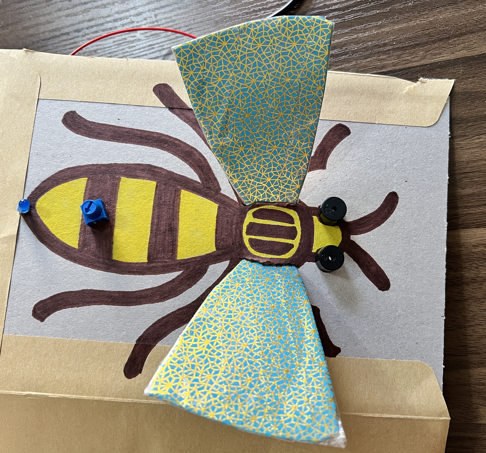

## Jouw idee

Gebruik deze stap om je sensorische gadget te plannen. Je kunt het plannen door erover na te denken, te knutselen, te tekenen of te schrijven, of hoe je maar wilt!  

{:width="300px"}

### Waarom maak je je sensorische gadget?

--- task ---

Denk aan het doel van je sensorische gadget.

Dat kan zijn:
+ Voor een jongere broer om meer te weten te komen over bezienswaardigheden en geluiden
+ Een manier om de spanning te verlichten door knoppen in te drukken en geluiden te horen
+ Een communicatiemiddel om mensen te helpen hun behoeften te uiten

--- /task ---

### Voor wie is het?

--- task ---

Bedenk voor wie je je sensorische gadget gaat maken (je **publiek**).

Het zou voor een vriend, voor een familielid, voor een schoolklas, voor mensen die een hobby delen, voor fans van een TV-programma of musicus, of alleen voor jezelf kunnen zijn.

--- /task ---

### Welke functies heeft je gadget?

--- task ---

Bedenk hoeveel onderdelen je gadget nodig heeft.

[[[pico-limitations]]]

--- /task ---

--- task ---

Denk aan de soorten in- en uitgangen die je zult hebben.

Je gadget zou het volgende kunnen doen:
+ Drukknoppen hebben voor ingangen
+ Zelfgemaakte schakelaars gebruiken
+ Gebruik een instelwielingang met behulp van een potentiometer
+ Speel een bepaald geluid af
+ Speel een of meer melodieën af
+ Gebruik eenkleurige LED's
+ Gebruik een RGB LED

--- /task ---

--- task ---

Bedenk hoe je sensorische gadget eruit zal zien.

Het zou:

+ Gebaseerd kunnen zijn op een sensorisch gadget dat al bestaat zoals een fidget kubus of popper
+ Een thema kunnen hebben dat is gebaseerd op je favoriete strip, tv-programma of nummer
+ Een zelfgemaakte behuizing kunnen hebben, gemaakt van een oude kartonnen doos, een lap stof of een plastic bakje

--- /task ---

### Aan de slag

--- task ---

Verzamel de onderdelen die je nodig hebt om je sensorische gadget te maken. Je hebt ingangen, uitgangen, verbindingsdraden en je Raspberry Pi Pico nodig.

--- /task ---

--- task ---

**Test:** Sluit de Raspberry Pi Pico aan op de computer en controleer of deze werkt door de ingebouwde LED te laten knipperen.

Hier is een voorbeeldcode voor het laten knipperen van de ingebouwde LED:

--- code ---
---
language: python filename: line_numbers: false line_number_start: 1
line_highlights:
---
from picozero import pico_led from time import sleep

pico_led.on() sleep(1) pico_led.off() --- /code ---

--- /task ---

--- task ---

Als je de ingangen en uitgangen nog niet hebt voorbereid en je nog niet weet hoe je LED's op weerstanden en verbindingsdraden moet aansluiten, bezoek dan onze [Inleiding tot de Raspberry Pi Pico](https://projects.raspberrypi.org/en/projects/introduction-to-the-pico){:target="_blank"} gids.

--- /task ---

