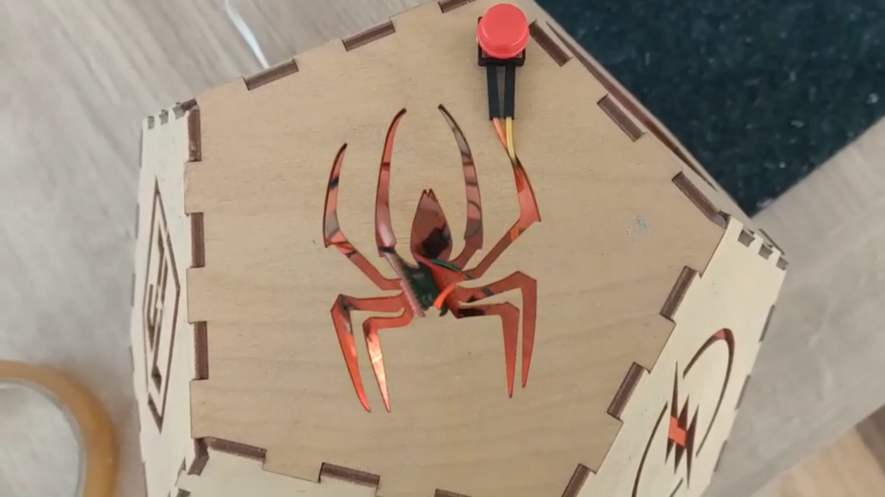

# Verbeter je project

Als je tijd hebt, kun je jouw project verbeteren.

--- task ---

Je kunt elk van de voorbeelden in de [Inleiding](.) eens goed bekijken om te zien hoe de code werkt en meer inspiratie te krijgen.

--- /task ---

--- task ---

Hier zijn een paar andere ideeën die je zou kunnen proberen:
+ Doe wat testen met je publiek en verbeter vervolgens de bruikbaarheid
+ Voeg meer input- of output-componenten toe
+ Blijf knutselen aan je apparaat om de structuur of het ontwerp te verbeteren

--- /task ---

--- no-print ---

**De sterrenhemel**

Het originele **Sterrenhemel** project gebruikte een enkele RGB-LED en een stuk karton met gaten erin geprikt om een sterrenhemel te simuleren met geprojecteerd licht, dat met een knop in- en uitgeschakeld kon worden.

Deze verbeterde versie van het project voegt nog een RGB-LED toe om de helderheid te verhogen, en voegt een diffuser toe voor de LED's om het licht breder te verspreiden.

De kaart met gaten is vervangen door een lasergesneden dodecaëder, met de logo's van populaire superhelden die worden gebruikt als uitsparingen om het licht in de kamer te projecteren.

<video width="640" height="360" controls>
<source src="images/PicoUpgrade.mp4" type="video/mp4">
Je browser ondersteunt geen WebM-video, probeer Firefox of Chrome
</video>

--- /no-print ---

--- print-only ---

**De sterrenhemel**

Het originele **Sterrenhemel** project gebruikte een enkele RGB-LED en een stuk karton met gaten erin geprikt om een sterrenhemel te simuleren met geprojecteerd licht, dat met een knop in- en uitgeschakeld kon worden.

Deze verbeterde versie van het project voegt nog een RGBLED toe om de helderheid te verhogen, en voegt een diffuser toe voor de LED's om het licht breder te verspreiden.

De kaart met gaten is vervangen door een lasergesneden dodecaëder, met de logo's van populaire superhelden die worden gebruikt als uitsparingen om het licht in de kamer te projecteren.

{:width="300px"}

--- /print-only ---

--- task ---

Bekijk onze [Sensorische gadget - Community](https://wke.lt/w/s/qX5TaK){:target="_blank"} galerie om projecten te bekijken die zijn gemaakt door onze community-leden.

--- /task ---

