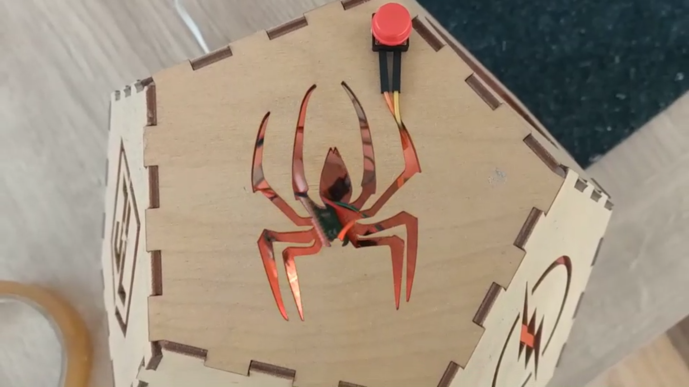

## Deel

Als je lid bent van een club, waarom zou je je project dan niet delen met vrienden? Je kunt jouw familie ook laten zien hoe jouw project werkt.

--- task ---

Inspireer de Raspberry Pi Foundation-gemeenschap met jouw project!

Als je een video van je gadget wilt verzenden naar onze [zingtuigelijk gadget - Community](https://wke.lt/w/s/qX5TaK){:target="_blank"} galerie, vul dan [dit formulier](https://form.raspberrypi.org/f/community-project-submissions){:target="_blank"} in. Vergeet niet om je identiteit te beschermen door ervoor te zorgen dat mensen niet (herkenbaar) in je video verschijnen.

--- /task ---

--- no-print ---

**De sterrenhemel**

Het originele **Sterrenhemel** project gebruikte een enkele RGB-LED en een stuk karton met gaten erin geprikt om een sterrenhemel te simuleren met geprojecteerd licht, dat met een knop in- en uitgeschakeld kon worden.

Deze verbeterde versie van het project voegt nog een RGB-LED toe om de helderheid te verhogen, en voegt een diffuser toe voor de LED's om het licht breder te verspreiden.

De kaart met gaten is vervangen door een lasergesneden dodecaëder, met de logo's van populaire superhelden die worden gebruikt als uitsparingen om het licht in de kamer te projecteren.

<video width="640" height="360" controls>
<source src="images/PicoUpgrade.mp4" type="video/mp4">
Je browser ondersteunt geen WebM-video, probeer Firefox of Chrome
</video>

--- /no-print ---

--- print-only ---

**De sterrenhemel**

Het originele **Sterrenhemel** project gebruikte een enkele RGB-LED en een stuk karton met gaten erin geprikt om een sterrenhemel te simuleren met geprojecteerd licht, dat met een knop in- en uitgeschakeld kon worden.

Deze verbeterde versie van het project voegt nog een RGB-LED toe om de helderheid te verhogen, en voegt een diffuser toe voor de LED's om het licht breder te verspreiden.

De kaart met gaten is vervangen door een lasergesneden dodecaëder, met de logo's van populaire superhelden die worden gebruikt als uitsparingen om het licht in de kamer te projecteren.

{:width="300px"}

--- /print-only ---

--- task ---

Bekijk onze [zingtuigelijk gadget - Community](https://wke.lt/w/s/qX5TaK){:target="_blank"} galerie om projecten te bekijken die zijn gemaakt door onze community-leden.

--- /task ---
